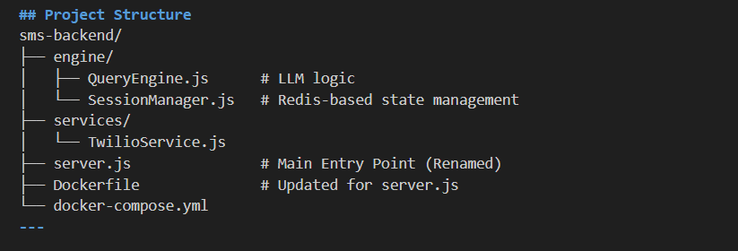

# Backend Query Engine for SMS Queries(Node.js + Twilio)

This project is a simple, production-ready **Node.js + Express backend** that allows customers to send **SMS messages from mobile phones** and receive automated replies using **Twilio**.

The system is designed for **service providers** who want to handle customer queries via text messages.

---

## 📌 Features

- Receive SMS messages from multiple customers
- Identify customers by phone number
- Process queries using a query engine
- Send automated replies via SMS
- Stateless SMS handling with conversation state support
- Easily extensible for AI, databases, and human handoff

---

## 🏗 Architecture Overview

Customer Phone  
↓ SMS  
Mobile Carrier  
↓  
Twilio  
↓ HTTP Webhook (POST)  
Node.js / Express Server  
↓  
Query Engine (Rules / DB / AI)  
↓  
Twilio  
↓ SMS  
Customer Phone  

There is **no persistent connection** between the phone and server.  

### TODO: Establish Persistant Cnnection and State between customers and server
Each SMS triggers a new HTTP request.

State is managed by the backend server
---

## 🛠 Tech Stack

- Node.js
- Express.js
- Twilio SMS API
- dotenv
- body-parser

---

---

## Prerequisites

- Node.js v16+
- npm
- Twilio account
- SMS-capable Twilio phone number
- Internet-accessible HTTPS URL

---

## 🚀 Installation

1. Clone the repository

git clone https://github.com/your-org/sms-backend.git  
cd sms-backend  

2. Install dependencies

npm install  

---

## 🔐 Environment Variables

Create a `.env` file:

PORT=3000  
TWILIO_ACCOUNT_SID=your_account_sid  
TWILIO_AUTH_TOKEN=your_auth_token  
TWILIO_PHONE_NUMBER=+1234567890  

---

## ▶️ Running the Server

node index.js  

Server will start on http://localhost:3000

---

## 🌍 Expose Local Server (Development)

Use ngrok:

ngrok http 3000  

---

## 📩 Twilio Webhook Configuration

In Twilio Console → Phone Number → Messaging:

Webhook URL: https://your-domain.com/sms  
Method: POST  

---

## 🧠 Key Design Principle

Phones do NOT connect directly to your server.  
Twilio bridges telecom networks and your backend.

---

## 📄 License

MIT License
